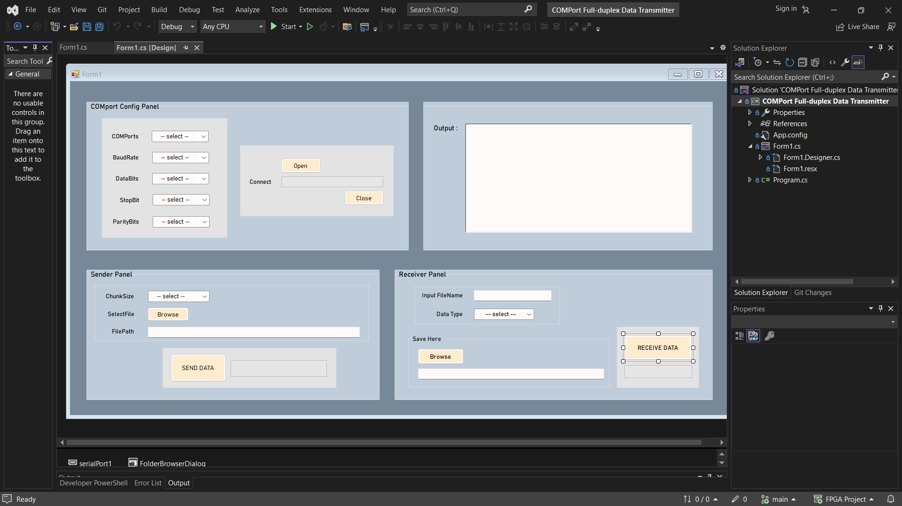

# Full-Duplex Data Transmitter with COM Port

This project is a C# application developed in Visual Studio, designed to facilitate full-duplex data transmission over a COM port. It is utilized in Visual Light Communication (VLC) systems.

## Table of Contents

- [Overview](#overview)
- [Features](#features)
- [Installation](#installation)
- [Usage](#usage)
- [Contributing](#contributing)
- [Open Source](#open-source)
- [Acknowledgements](#acknowledgements)

## Overview

This application provides a graphical user interface (GUI) for configuring and managing full-duplex data transmission through a COM port. The primary application of this project is in Visual Light Communication (VLC) systems.




## Features

- **COM Port Configuration Panel:** Allows the user to select COM port settings including Baud Rate, Data Bits, Stop Bits, and Parity Bits.
- **Sender Panel:** Enables the user to select a file and configure the chunk size for data transmission.
- **Receiver Panel:** Allows the user to specify the input file name and data type for receiving data.
- **Output Display:** Shows the transmission and reception status.
- **Control Buttons:** `Open`, `Close`, `Connect`, `Send Data`, and `Receive Data` buttons to manage the communication process.

## Installation

1. Clone the repository:
    ```sh
    git clone https://github.com/yourusername/FullDuplexDataTransmitter.git
    ```
2. Open the solution in Visual Studio:
    ```sh
    cd FullDuplexDataTransmitter
    ```
3. Open the `COMPort Full-duplex Data Transmitter.sln` file in Visual Studio.
4. Restore the NuGet packages:
    ```sh
    nuget restore
    ```
5. Build the solution in Visual Studio.

## Usage

1. Launch the application by running the built executable or from Visual Studio.
2. Configure the COM port settings in the **COM Port Configuration Panel**.
3. Use the **Sender Panel** to select a file and set the chunk size for sending data.
4. Specify the input file name and data type in the **Receiver Panel**.
5. Use the control buttons to manage the connection and data transmission:
    - `Open`: Opens the selected COM port.
    - `Close`: Closes the COM port.
    - `Connect`: Establishes the connection for data transmission.
    - `Send Data`: Starts sending data based on the configured settings.
    - `Receive Data`: Begins receiving data according to the specified parameters.

## Contributing

Contributions are welcome! Please fork the repository and create a pull request with your changes.

## Open Source

This project is open source and contributions from the community are encouraged. Feel free to fork the repository and submit pull requests for any improvements or bug fixes.

## Acknowledgements

- [Visual Studio](https://visualstudio.microsoft.com/)
- [C# Programming Language](https://docs.microsoft.com/en-us/dotnet/csharp/)
- [Visual Light Communication (VLC)](https://en.wikipedia.org/wiki/Visible_light_communication)
